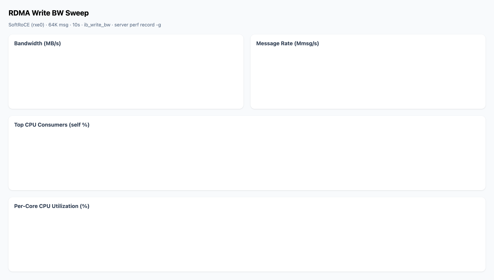

# RDMA Sweep Tool

Automated RDMA perftest benchmarking with server-side CPU profiling (`perf record -g`).

Sweeps a grid of perftest parameters (QP count, message size, etc.) — each combo runs `ib_write_bw` server+client on the same host, captures bandwidth/latency from perftest JSON output, and profiles the server's CPU with `perf record -g`.

## Usage

```bash
pip install pyyaml

# Write a sweep config
cat > sweep.yaml << 'EOF'
test: ib_write_bw
server_host: 127.0.0.1
perftest_dir: /tmp/perftest
duration: 10
fixed:
  port: 18515
  msg_size: 64K
sweep:
  - name: qp
    values: [2, 4, 8, 16, 32, 64, 128]
EOF

# Run it
sudo python3 rdma_sweep.py -c sweep.yaml -o results/

# Generate interactive chart
python3 plot_sweep.py results/
# open results/chart.html
```

## Output

```
results/
├── 0001/result.json       # Per-combo perftest output + perf profile
├── 0002/result.json
├── ...
├── summary.json           # All combos merged into one table
├── summary.csv            # Same, for spreadsheets
└── chart.html             # Interactive Chart.js visualization
```

Each `result.json` includes:

| Field | Source |
|-------|--------|
| `results.BW_average` | perftest `--out_json` |
| `results.MsgRate` | perftest |
| `_process.server_perf` | `perf record -g` → `perf report` |
| `_process.client_usage` | `/usr/bin/time` |
| `_meta.cpu_util_per_core` | `/proc/stat` before/after delta |
| `_meta.memory` | `/proc/meminfo` |

## Supported sweep parameters

| Config key | Flag | Description |
|------------|------|-------------|
| `msg_size` | `-s` | Message size |
| `qp` | `-q` | Queue pairs |
| `tx_depth` | `-t` | TX depth |
| `rx_depth` | `-r` | RX depth |
| `port` | `-p` | Port |
| `duration` | `-D` | Test seconds |
| `device` | `-d` | IB device (e.g. rxe0) |
| *(any other)* | `--{name}` | Passed through to perftest |

## Example: QP scaling on SoftRoCE

Run included at `examples/qp_scale/` — QP sweep 2→128 on SoftRoCE (rxe0), 64K msg, 10s:



Key finding: bandwidth stays flat at ~715 MB/s across all QP counts. The bottleneck shifts between kernel subsystems as QP scales, but SoftRoCE throughput is stable once steady-state is reached.
