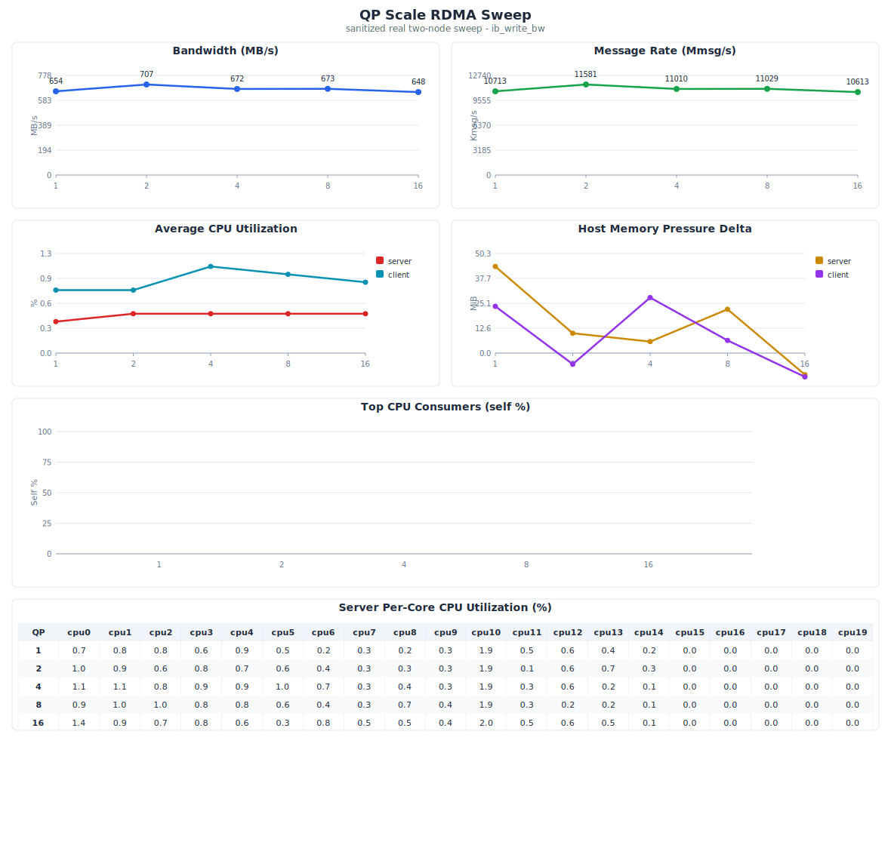

# RDMA Sweep Tool

Two operations:

### 1. Run sweep — produce raw data

```bash
pip install pyyaml

cat > sweep.yaml << 'EOF'
test: ib_write_bw
server_host: 127.0.0.1
perftest_dir: /tmp/perftest
duration: 10
fixed:
  port: 18515
  msg_size: 64K
sweep:
  - name: qp
    values: [2, 4, 8, 16, 32, 64, 128]
EOF

sudo python3 rdma_sweep.py -c sweep.yaml -o results/
```

### 2. Generate report — SVG chart from existing data

```bash
python3 rdma_sweep.py --report results/
# -> results/chart.svg
# -> results/chart.pdf (if cairosvg installed)
```

## Output

```
results/
 0001/result.json       # Per-combo perftest + perf profile
 0002/result.json
 ...
 summary.json           # All combos merged
 summary.csv
 chart.svg              # Report (generated by --report)
 chart.pdf              # (optional, requires cairosvg)
```

## Sweep parameters

| Config key  | Flag       | Description                  |
|-------------|------------|------------------------------|
| msg_size    | -s         | Message size                 |
| qp          | -q         | Queue pairs                  |
| tx_depth    | -t         | TX depth                     |
| rx_depth    | -r         | RX depth                     |
| port        | -p         | Port                         |
| duration    | -D         | Test seconds                 |
| device      | -d         | IB device                    |
| *(other)*   | `--{name}` | Passed through to perftest   |

## Example

QP scaling on SoftRoCE (rxe0), 64K msg, 10s:


